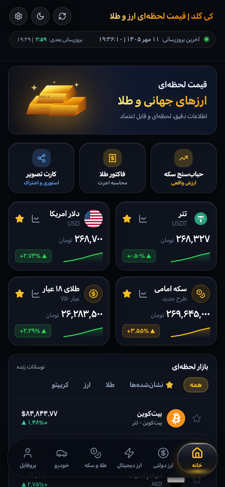
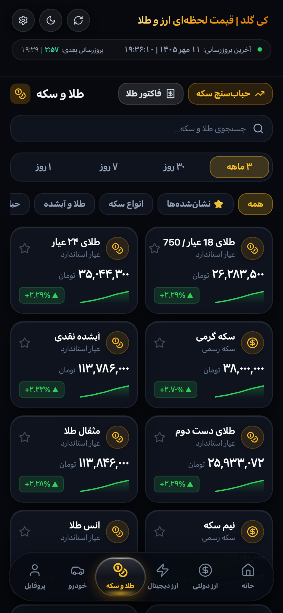
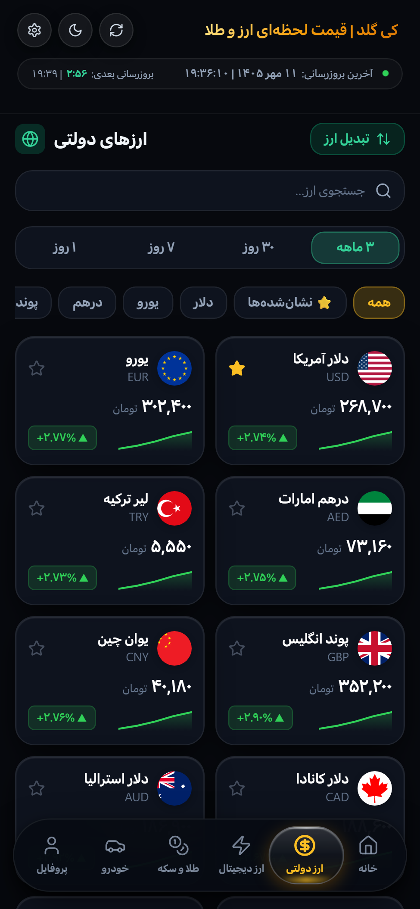
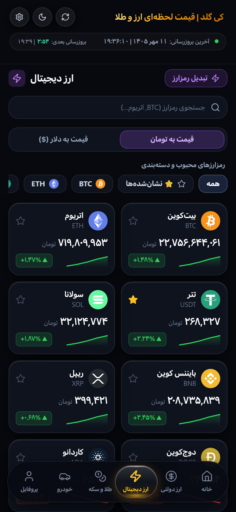
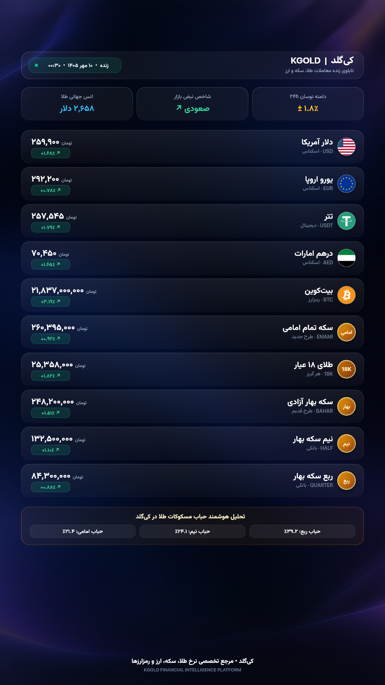
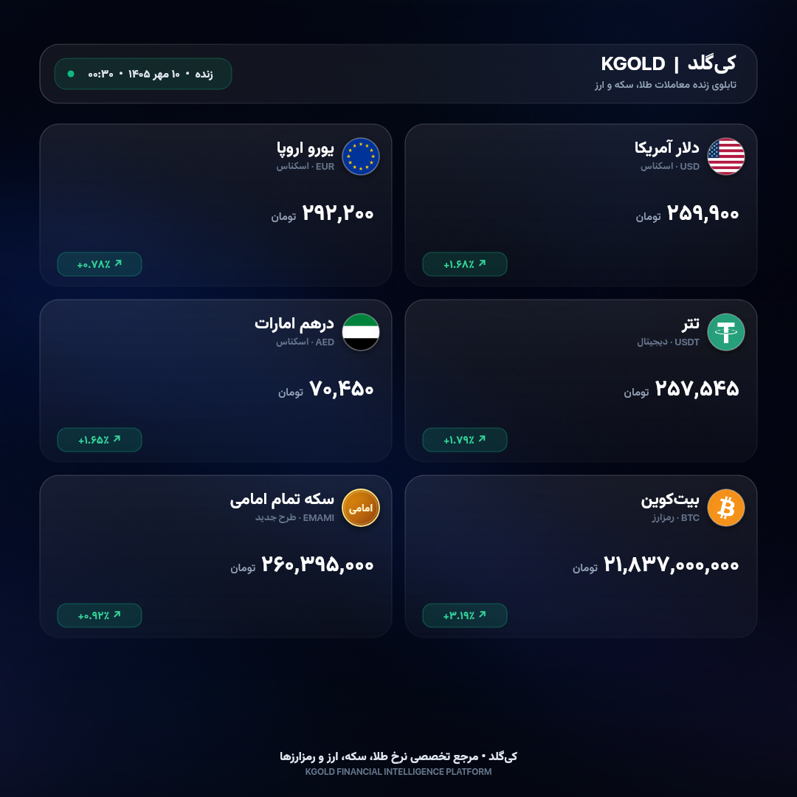

<div align="center">

  

  # کی‌گلد | KGold
  ### سامانه مدرن پایش نرخ لحظه‌ای طلا، سکه، ارزهای فیات و رمزارزها
  ### Modern Real-time Financial Tracker for Gold, Currencies & Crypto

  <p align="center">
    <a href="https://github.com/pooriyayt/k-gold-pr/releases/latest">
      
    </a>
    <a href="https://www.virustotal.com/gui/file/373befbc1fb16d4df1e9177b168c8c271ddcb0b76047c85278378ee00fb923cd">
      
    </a>
    <a href="https://github.com/pooriyayt/k-gold-pr">
      
    </a>
    <a href="#-مجوز--license">
      
    </a>
  </p>

  <p align="center">
    <a href="#-فارسی">🌐 مستندات فارسی</a> &nbsp;•&nbsp; <a href="#-english">🌐 English Documentation</a>
  </p>

  <p align="center">
    <a href="https://github.com/pooriyayt/k-gold-pr/releases/latest/download/KGold.apk">
      
    </a>
  </p>

</div>

---

<div id="-فارسی" dir="rtl">

## 🌐 درباره کی‌گلد (KGold)

**کی‌گلد** یک اپلیکیشن سبک، سریع و کاملاً مدرن برای سیستم‌عامل اندروید است که با تمرکز بر سرعت فوق‌العاده، طراحی لوکس و بدون هیچ‌گونه تبلیغات مزاحم توسعه داده شده است. این برنامه دسترسی لحظه‌ای و دقیق به قیمت‌های طلا، انواع مسکوکات به همراه حباب، ارزهای بین‌المللی با پرچم رسمی، رمزارزهای مطرح و نرخ روز خودرو را برای کاربران فراهم می‌سازد.

---

### 📱 پیش‌نمایش محیط برنامه و کارت‌های اشتراک‌گذاری

<div align="center">
  <p><b>نمای صفحات اصلی برنامه (In-App Interface)</b></p>
  <table>
    <tr>
      <td align="center"><b>داشبورد اصلی</b></td>
      <td align="center"><b>طلا و انواع سکه</b></td>
      <td align="center"><b>ارزهای بین‌المللی</b></td>
      <td align="center"><b>بازار رمزارزها</b></td>
    </tr>
    <tr>
      <td align="center"></td>
      <td align="center"></td>
      <td align="center"></td>
      <td align="center"></td>
    </tr>
  </table>

  <p><b>کارت‌های اشتراک‌گذاری شبکه‌های اجتماعی (Social Share Cards)</b></p>
  <table>
    <tr>
      <td align="center"><b>کارت استوری اینستاگرام (۹:۱۶)</b></td>
      <td align="center"><b>کارت پست و شبکه‌های اجتماعی (۱:۱)</b></td>
    </tr>
    <tr>
      <td align="center"></td>
      <td align="center"></td>
    </tr>
  </table>
</div>

---

### ✨ ویژگی‌های برجسته برنامه

- 🪙 **طلا و انواع مسکوکات:**
  - قیمت لحظه‌ای طلای ۱۸ عیار، ۲۴ عیار، مثقال طلا و انس جهانی
  - قیمت انواع سکه: تمام بهار آزادی (طرح قدیم)، امامی (طرح جدید)، نیم‌سکه، ربع‌سکه و سکه گرمی
  - محاسبه آنی و شفاف حباب قیمت سکه‌ها

- 💵 **ارزهای بین‌المللی با پرچم رسمی:**
  - دلار آمریکا، یورو، درهم امارات، پوند انگلیس، لیر ترکیه، یوان چین، دلار کانادا و استرالیا
  - چینش استاندارد و دارای بج پرچم مدور باکیفیت برای هر ارز

- ⚡ **بازار رمزارزها (Cryptocurrency):**
  - بیت‌کوین (BTC)، اتریوم (ETH)، تتر (USDT)، سولانا (SOL)، تون‌کوین (TON) و...
  - نمایش هم‌زمان قیمت تومانی و معادل دلاری به همراه درصد نوسان روزانه

- 🚗 **قیمت روز خودرو:**
  - رصد قیمت انواع خودروهای پرتیراژ داخلی و مونتاژی

- 📈 **نمودارهای تعاملی و اسپارک‌لاین‌ها:**
  - تاریخچه دقیق قیمتی با اسپارک‌لاین‌های نوسان و نمودارهای دوره‌ای (۷ روزه، ۳۰ روزه و سالانه)

- 🎨 **تولید کارت‌های اشتراک‌گذاری لوکس (Luxury Share Cards):**
  - خروجی تصویر فوق‌العاده باکیفیت برای **استوری اینستاگرام (۹:۱۶)** و **پست (۱:۱)**
  - طراحی مینیمال، تایپوگرافی شکیل و آماده اشتراک در شبکه‌های اجتماعی با یک کلیک

- 📲 **ویجت اختصاصی صفحه اصلی اندروید (Ultra HD Home Widget):**
  - ویجت هوم‌اسکرین با ابعاد استاندارد و بهینه‌سازی شده برای تمام لانچرها
  - همگام‌سازی هوشمند و به‌روزرسانی در پس‌زمینه بدون مصرف غیرضروری باتری

- 💼 **مدیریت سبد دارایی و پرتفوی:**
  - امکان ثبت دارایی‌ها و محاسبه لحظه‌ای سود و زیان به تفکیک دارایی

- 🔔 **هشدارهای هوشمند قیمتی (Price Alerts):**
  - تنظیم آستانه نوسان و دریافت هشدار هنگام عبور نرخ از سقف یا کف مشخص‌شده

- 🔄 **سیستم آپدیت خودکار درون‌برنامه‌ای:**
  - بررسی هوشمند نسخه جدید از گیت‌هاب و امکان دانلود و نصب مستقیم از داخل برنامه

- 🛡️ **امنیت، شفافیت و حریم خصوصی:**
  - **نمره ۰/۶۶ در VirusTotal:** اسکن‌شده توسط ۶۶ آنتی‌ویروس معتبر بدون حتی یک مورد مشکوک
  - سورس‌کد کاملاً متن‌باز، بدون جمع‌آوری اطلاعات شخصی، بدون تبلیغات و با امضای معتبر رسمی (Keystore V1 & V2)

---

### 📥 دانلود و نصب

آخرین فایل نصبی برنامه را می‌توانید مستقیماً از بخش **[Releases](https://github.com/pooriyayt/k-gold-pr/releases/latest)** دانلود نمایید:

1. فایل **`KGold.apk`** را دانلود کنید.
2. آن را روی گوشی اندرویدی خود نصب کنید.
3. در صورت نمایش پیغام نصب از منابع ناشناس، اجازه نصب را تایید کنید (برنامه کاملاً امن و تاییدشده است).

---

### 🛠 فناوری‌ها و ابزارهای توسعه

- **هسته وب و رابط کاربری:** React 18, TypeScript, Vite
- **استایل‌دهی و انیمیشن‌ها:** Tailwind CSS, Framer Motion, Lucide React
- **پل ارتباطی اندروید:** Capacitor 7 (Haptics, Status Bar, Preferences)
- **بخش بومی اندروید:** Android Native SDK, AppWidgetProvider, Keystore Signature v1/v2
- **طراحی دیزاین:** اصول طراحی Apple HIG با جلوه Liquid Glass و پالت رنگی Dark Luxe

---

### 💻 راهنمای اجرای محلی و توسعه

برای اجرای پروژه روی سیستم خود مراحل زیر را دنبال کنید:

```bash
# کلون کردن مخزن
git clone https://github.com/pooriyayt/k-gold-pr.git
cd k-gold-pr

# نصب وابستگی‌ها
npm install

# اجرای نسخه وب در حالت توسعه
npm run dev

# ساخت خروجی نهایی وب
npm run build

# همگام‌سازی با پروژه اندروید
npx cap sync android
```

برای بیلد خروجی APK اندروید:
```bash
# ورود به پوشه اندروید و ساخت Release APK
cd android
./gradlew assembleRelease
```
فایل APK خروجی در مسیر زیر قرار می‌گیرد:
`android/app/build/outputs/apk/release/app-release.apk`

</div>

---

<div id="-english">

## 🌐 KGold - Overview (English)

**KGold** is a lightweight, ultra-fast, and modern Android application designed for monitoring and tracking real-time prices of gold, bullion coins (with bubble analysis), foreign exchange rates, cryptocurrencies, and regional car prices.

Built with performance and aesthetics in mind, KGold features an ad-free experience, Apple Human Interface Guidelines-inspired luxury design, and full background-synced home screen widgets.

---

### 📱 In-App Screenshots & Social Share Cards

<div align="center">
  <p><b>Core Application Screens</b></p>
  <table>
    <tr>
      <td align="center"><b>Dashboard</b></td>
      <td align="center"><b>Gold & Coins</b></td>
      <td align="center"><b>Currencies</b></td>
      <td align="center"><b>Cryptocurrency</b></td>
    </tr>
    <tr>
      <td align="center"></td>
      <td align="center"></td>
      <td align="center"></td>
      <td align="center"></td>
    </tr>
  </table>

  <p><b>Social Share Cards (Story & Post)</b></p>
  <table>
    <tr>
      <td align="center"><b>Instagram Story (9:16)</b></td>
      <td align="center"><b>Social Feed Post (1:1)</b></td>
    </tr>
    <tr>
      <td align="center"></td>
      <td align="center"></td>
    </tr>
  </table>
</div>

---

### ✨ Key Features

- **🪙 Gold & Coins:** Real-time 18K and 24K gold, Mesghal, Emami coins, Bahar Azadi, Half/Quarter coins, and Coin Bubble calculation.
- **💵 Currencies with Official Badges:** US Dollar, Euro, UAE Dirham, British Pound, Turkish Lira, Chinese Yuan, and more with official circular country flags.
- **⚡ Cryptocurrencies:** Bitcoin (BTC), Ethereum (ETH), Tether (USDT), Solana (SOL), TON, and top assets with live Toman & USD pricing.
- **🚗 Car Market:** Live prices for domestic and assembled vehicles.
- **📈 Interactive Trend Charts:** Sparklines and historical price charts (7-day, 30-day, and 1-year analysis).
- **🎨 Luxury Social Share Cards:** Export ultra-crisp Instagram Story (9:16) and Square Post (1:1) cards with real-time rates and flags.
- **📲 Android Home Screen Widget:** Ultra HD native Android widget with seamless background synchronization.
- **💼 Portfolio Tracker:** Keep track of personal assets and monitor real-time profit/loss in Toman.
- **🔔 Price Alerts:** Set custom low/high target alerts.
- **🔄 In-App Updater:** Automatic background checks for GitHub releases with direct APK download & update.
- **🛡️ 100% Clean & Verified:** Rated **0/66 (Undetected)** on **VirusTotal**, fully open-source, zero ads, and signed with official V1 & V2 APK keys.

---

### 🛡️ Security & Integrity

| Property | Details |
| :--- | :--- |
| **Package Name** | `com.kgold.app` |
| **VirusTotal Status** | **0/66 Clean** (Passed all 66 top antivirus vendors) |
| **Permissions** | Basic Internet only (`INTERNET`, `ACCESS_NETWORK_STATE`) |
| **Telemetry / Ads** | None. Zero tracking, zero third-party ads |
| **Signing Scheme** | APK Signature Scheme v1 & v2 (Valid until 2054) |

---

### 📥 Download & Installation

Grab the latest verified APK directly from the **[Releases](https://github.com/pooriyayt/k-gold-pr/releases/latest)** page:

- **Direct Download:** [`KGold.apk`](https://github.com/pooriyayt/k-gold-pr/releases/latest/download/KGold.apk)

---

### 🛠 Tech Stack

- **Frontend:** React 18, TypeScript, Vite
- **Styling & Motion:** Tailwind CSS, Framer Motion, Lucide Icons
- **Hybrid Bridge:** Capacitor 7
- **Native Android:** Java/Kotlin, Android AppWidgetProvider, Gradle
- **Design System:** Apple HIG & Liquid Glass Aesthetics

---

### 💻 Local Development

```bash
# Clone the repository
git clone https://github.com/pooriyayt/k-gold-pr.git
cd k-gold-pr

# Install dependencies
npm install

# Start Vite dev server
npm run dev

# Build web distribution
npm run build

# Sync with Android
npx cap sync android
```

To build a release APK locally:
```bash
cd android
./gradlew assembleRelease
```
The compiled APK will be generated at:
`android/app/build/outputs/apk/release/app-release.apk`

</div>

---

## 📄 مجوز / License

این پروژه تحت مجوز **MIT** منتشر شده است. برای اطلاعات بیشتر فایل `LICENSE` را مطالعه کنید.  
This project is open-source and available under the **MIT License**.
